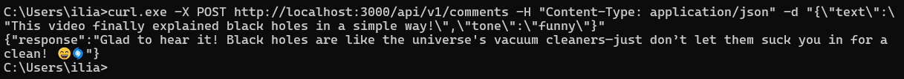
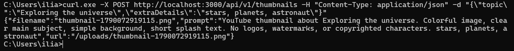
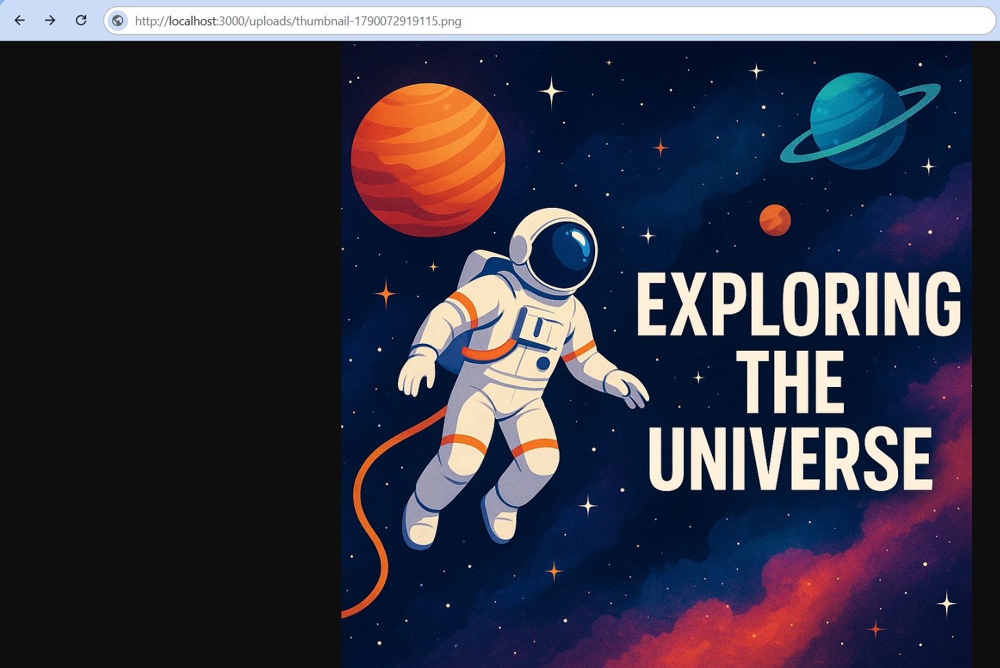

# AI Commenter

This app uses a course-specific OpenAI proxy.

## Setup

1. Connect to the Metropolia VPN.
2. Copy environment variables:

```bash
cp .env.sample .env
```

3. Install dependencies and start the server:

```bash
npm install
npm run dev
```

The API runs at `http://localhost:3000`.

## Assignment 1: Comment generator

`POST /api/v1/comments`

Request body:

```json
{
  "text": "This video finally explained black holes in a simple way!",
  "tone": "friendly"
}
```

`tone` is optional. Supported values: `friendly`, `funny`, `formal`, `sarcastic`, `professional`. The default is `friendly`.

Example response:

```json
{
  "response": "Glad it helped! Black holes are wild, but they get easier once the basics click."
}
```

## Assignment 2: Thumbnail generator

`POST /api/v1/thumbnails`

Request body:

```json
{
  "topic": "Exploring the universe",
  "extraDetails": "stars, planets, astronaut, splash text Explore the Universe!"
}
```

`extraDetails` is optional.

Example response:

```json
{
  "filename": "thumbnail-1710000000000.png",
  "prompt": "Create a colorful YouTube thumbnail about: Exploring the universe. ...",
  "url": "/uploads/thumbnail-1710000000000.png"
}
```

The image is saved in the `uploads` folder and can be opened at `http://localhost:3000/uploads/<filename>`.

## Testing with curl

```bat
curl.exe -X POST http://localhost:3000/api/v1/comments -H "Content-Type: application/json" -d "{\"text\":\"This video finally explained black holes in a simple way!\",\"tone\":\"funny\"}"
```



```bat
curl.exe -X POST http://localhost:3000/api/v1/thumbnails -H "Content-Type: application/json" -d "{\"topic\":\"Exploring the universe\",\"extraDetails\":\"stars, planets, astronaut\"}"
```




